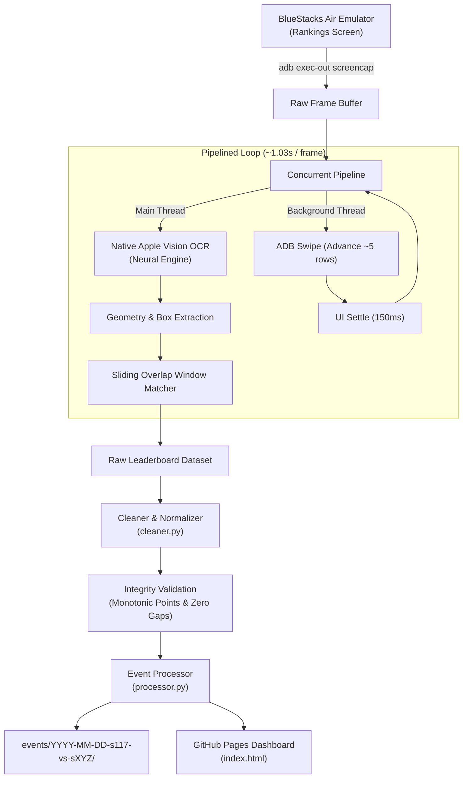

# Capitol War Ingestion Pipeline — Z Route: Redemption

A high-performance, automated data gathering pipeline for extracting, cleaning, and publishing complete Capitol War event leaderboards from **BlueStacks Air** directly to **GitHub Pages**.

---

## Architecture Overview



---

## Prerequisites

1. **Host Machine:** macOS (Apple Silicon recommended for native Neural Engine hardware OCR).
2. **Android Emulator:** BlueStacks Air running *Z Route: Redemption*.
3. **Android Debug Bridge (`adb`):**
   ```sh
   brew install android-platform-tools
   ```
4. **Apple Swift Compiler:** Included with Xcode or Command Line Tools:
   ```sh
   xcode-select --install
   ```

---

## Quick Start (One Command)

1. Open *Z Route: Redemption* in BlueStacks Air and navigate to:
   **Capitol Event &rarr; Rankings Tab**.
2. Run the pipeline from the repository root:

```sh
python3 pipeline/run_pipeline.py --date "2026-10-03" --opponent "113" --home-role attacking
```

The pipeline will:
- Auto-detect the BlueStacks ADB instance (`127.0.0.1:5565`).
- Automatically compile `vision_ocr.swift` if needed.
- Rewind the leaderboard smoothly to Rank 1.
- Stream screencaps and execute asynchronous scrolling at ~1 second per frame.
- Automatically detect the bottom of the leaderboard (hard stop).
- Normalize OCR artifacts and alliance tags (e.g. consolidating `[P1MP] JU1CE`).
- Validate data integrity (0 missing ranks, monotonic point ordering).
- Generate event assets under `events/<date>-s117-vs-s<opponent>/`.
- Update `manifest.json`, `manifest.js`, and the interactive GitHub Pages dashboard.

3. Push the new event to GitHub Pages:
```sh
git add .
git commit -m "feat(event): add Capitol War 2026-10-03 dataset"
git push origin main
```

---

## Command-Line Arguments

| Flag | Default | Description |
| :--- | :---: | :--- |
| `--date` | `Today` | Date of the Capitol event (`YYYY-MM-DD`). |
| `--opponent` | `119` | Opponent server number (e.g. `119`, `120`). |
| `--home` | `117` | Home server number (default: `117`). |
| `--home-role` | *(required)* | `attacking` or `defending`: S117's side in this Capitol War. The opponent gets the other role. |
| `--device` | Auto | ADB device identifier (auto-detects BlueStacks). |
| `--no-rewind` | False | Skip scrolling back to Rank 1 before starting. |
| `--from-file` | None | Skip capture and reprocess an existing raw JSON file. |

---

## Pipeline Components

* **`run_pipeline.py`**: Unified orchestrator managing ADB streaming, concurrency, and pipeline stages.
* **`vision_ocr.swift`**: High-performance Swift worker using Apple's `VNRecognizeTextRequest` (`Vision` framework) for sub-300ms multilingual character recognition.
* **`cleaner.py`**: Handles OCR text normalization, bracket repairs, server tag detection, and mathematical data integrity verification.
* **`processor.py`**: Builds alliance rosters, aggregates server statistics, creates spreadsheet CSVs, JSON data models, and registers events into the GitHub Pages site manifest.
* **`events/<id>/capture.json`**: Written after a live capture with the start/end time (local and UTC), duration, frame count and device. It is kept in the repo for record-keeping and is not loaded or shown by the dashboard. Reprocessing with `--from-file` leaves it unchanged.
* **`screenshots.py`** / **`events/<id>/screenshots/`**: Every capture frame is saved full-size to `~/Library/Caches/s117-zroute-captures/<id>/` and compressed (720px WebP, ~50 KB) into `events/<id>/screenshots/`, listed in `capture.json`. Not shown on the dashboard.
* **`tools/install_cleanup_agent.sh`**: Installs a LaunchAgent that deletes the local full-size frames after 3 days (`sh tools/install_cleanup_agent.sh [days]`, `--uninstall` to remove). Compressed copies in the repo are kept.

---

## Troubleshooting

* **Device not detected:** Verify ADB sees the BlueStacks emulator:
  ```sh
  adb devices
  ```
  If unlisted, connect manually: `adb connect 127.0.0.1:5565`.
* **Ranks skipping or bouncing:** Ensure the BlueStacks window is active and at 1080x1920 portrait resolution.
* **Reprocessing without recapturing:** If you want to update alliance rules on an existing event without re-running ADB:
  ```sh
  python3 pipeline/run_pipeline.py --from-file events/2026-09-19-s117-vs-s119/rankings.json
  ```

---

## Hands-off run (Apparatchik pause, navigation, QA)

One-time setup: pair the pipeline with Apparatchik (issue a code in the Apparatchik Mac app, as for the Android phone):
```sh
python3 pipeline/apparatchik_control.py pair <6-digit code>   # credential stored in the macOS login Keychain
python3 pipeline/apparatchik_control.py status
```

Then a full run is just:
```sh
python3 pipeline/run_pipeline.py --opponent 113 --home-role attacking
```
It will:
1. Pause Apparatchik monitoring with a timed safety pause (about 2x the expected run time). If you had already paused it yourself, it stays paused and is not resumed.
2. Back out of whatever is open, then tap **Expedition Frenzy**, the **Capitol Conquest** tab, then **Rankings** (each label found by OCR).
3. Rewind to rank 1 (checked against real rank digits), then capture with overlapping swipes. Rank numbers come from where each row sits on screen, and every reading of every rank is kept and voted on.
4. Handle the notification banner: it always appears at the same screen height. Rows under it are marked unreliable and never outvote clean reads, and the frame is re-captured after the banner clears.
5. Repair pass: scroll back to any missing, conflicting or out-of-order rank and re-read it (up to 2 rounds).
6. Back out to the world map and tap **RETURN TO CITY**, then resume Apparatchik straight away (the timed pause is only a fallback if the pipeline crashes).
7. Write `events/<id>/capture_qa.json` and exit non-zero if any rank is missing or unresolved (`--allow-incomplete` overrides).

Other flags: `--no-apparatchik` (do not pause/resume), `--no-navigate` (Rankings already open; stay there), `--swipe-px` (default 420), `--settle-sec`.

Tests (no emulator needed; real OCR fixtures checked against the verified 2026-10-03 data): `cd pipeline && python3 -m unittest discover -s tests -v`
