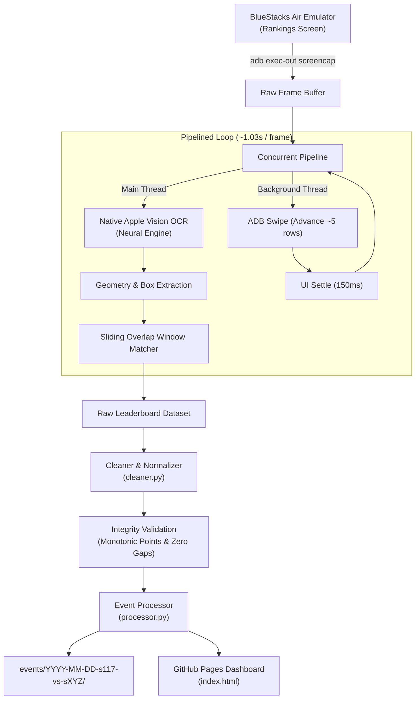

# Capitol War Ingestion Pipeline — Z Route: Redemption

A high-performance, automated data gathering pipeline for extracting, cleaning, and publishing complete Capitol War event leaderboards from **BlueStacks Air** directly to **GitHub Pages**.

---

## Architecture Overview



---

## Prerequisites

1. **Host Machine:** macOS (Apple Silicon recommended for native Neural Engine hardware OCR).
2. **Android Emulator:** BlueStacks Air running *Z Route: Redemption*.
3. **Android Debug Bridge (`adb`):**
   ```sh
   brew install android-platform-tools
   ```
4. **Apple Swift Compiler:** Included with Xcode or Command Line Tools:
   ```sh
   xcode-select --install
   ```

---

## Quick Start (One Command)

1. Open *Z Route: Redemption* in BlueStacks Air and navigate to:
   **Capitol Event &rarr; Rankings Tab**.
2. Run the pipeline from the repository root:

```sh
python3 pipeline/run_pipeline.py --date "2026-10-03" --opponent "113" --home-role attacking
```

The pipeline will:
- Auto-detect the BlueStacks ADB instance (`127.0.0.1:5565`).
- Automatically compile `vision_ocr.swift` if needed.
- Rewind the leaderboard smoothly to Rank 1.
- Stream screencaps and execute asynchronous scrolling at ~1 second per frame.
- Automatically detect the bottom of the leaderboard (hard stop).
- Normalize OCR artifacts and alliance tags (e.g. consolidating `[P1MP] JU1CE`).
- Validate data integrity (0 missing ranks, monotonic point ordering).
- Generate event assets under `events/<date>-s117-vs-s<opponent>/`.
- Update `manifest.json`, `manifest.js`, and the interactive GitHub Pages dashboard.

3. Push the new event to GitHub Pages:
```sh
git add .
git commit -m "feat(event): add Capitol War 2026-10-03 dataset"
git push origin main
```

---

## Command-Line Arguments

| Flag | Default | Description |
| :--- | :---: | :--- |
| `--date` | `Today` | Date of the Capitol event (`YYYY-MM-DD`). |
| `--opponent` | Detected | Opponent server number; required with `--from-file` or `--no-navigate`. |
| `--home` | `117` | Home server number (default: `117`). |
| `--home-role` | Detected | `attacking` or `defending`; required with `--from-file` or `--no-navigate`. |
| `--force-matchup` | False | Allow explicit opponent/role flags to disagree with the Conquest screen. |
| `--device` | Auto | ADB device identifier (auto-detects BlueStacks). |
| `--no-rewind` | False | Skip scrolling back to Rank 1 before starting. |
| `--no-humanize` | False | Disable input jitter and variable pauses; use the exact legacy input and timing. |
| `--from-file` | None | Reprocess rank records, including `events/<id>/capture_rankings.json`. |
| `--early-screenshots DIR` | None | OCR and merge early phone screenshots; archive them as `player-screenshot`. |
| `--early-cutoff N` | Auto | Use early ranks 1–N; auto selects the largest contiguous prefix without later overtakes. |
| `--allow-incomplete` | False | Publish despite failed QA; otherwise save outputs in local staging and exit 1. |
| `--nav-test` | False | Test navigation using a temporary screenshot directory, deleted afterwards. |
| `--no-navigate` | False | Start on Rankings and stay there; supply both matchup flags. |
| `--no-apparatchik` | False | Skip pausing/resuming Apparatchik monitoring. |
| `--swipe-px` | `420` | Swipe distance in pixels. |
| `--settle-sec` | `0.15` | Settle time after each swipe. |

Live runs humanize taps and swipes with small bounded jitter and vary pause timing while preserving capture overlap and seek accuracy. Use `--no-humanize` for exact legacy input and fixed delays; each live run prints whether humanized input was enabled and its total extra pause time.

---

## Pipeline Components

* **`run_pipeline.py`**: Unified orchestrator managing ADB streaming, concurrency, and pipeline stages.
* **`vision_ocr.swift`**: High-performance Swift worker using Apple's `VNRecognizeTextRequest` (`Vision` framework) for sub-300ms multilingual character recognition.
* **`cleaner.py`**: Handles OCR text normalization, bracket repairs, server tag detection, and mathematical data integrity verification.
* **`processor.py`**: Builds alliance rosters, aggregates server statistics, creates spreadsheet CSVs, JSON data models, and registers events into the GitHub Pages site manifest.
* **`early_screens.py`**: Fits phone OCR to the game column using Rankings headers and merges a safe early prefix, preserving capture names and identities.
* **`known_names.py`** / **`data/name_overrides.json`** / **`data/alliance_overrides.json`**: Apply manual corrections automatically and report fuzzy commander or alliance candidates for review. Commander suggestions never rename records automatically; alliance tag suggestions are automatic only for variants seen at most twice with supporting current or prior-event evidence. Suggestions are printed and saved in `capture_qa.json` without failing QA.
* **`events/<id>/capture_rankings.json`**: Keeps the capture's own cleaned rows before the early merge and new overrides, so reprocessing preserves the original scores/order.
* **`events/<id>/capture.json`**: Written after a live capture with the start/end time in server time (UTC-2, the in-game "State Time") and UTC, duration, frame count and device. It is kept in the repo for record-keeping and is not loaded or shown by the dashboard. Reprocessing with `--from-file` preserves it; adding early screenshots records their provenance and time range.
* **`screenshots.py`** / **`events/<id>/screenshots/`**: Full-size frames stay in `~/Library/Caches/s117-zroute-captures/<id>/`; archived images are resized to 720px WebP and listed in `capture.json`. Repair seek frames (`repair_seek_*`) are navigation-only and stay in the local cache. When the main capture reaches the bottom, only the last two consecutive frames that add no newly seen ranks are archived as bottom evidence; other capture, repair, navigation, rewind-check, and player screenshots are retained. Reprocessing deduplicates entries by file, keeping the latest metadata. Not shown on the dashboard. With the 2026-10-10 volume, the archive is expected to be about 343 images / 15.9 MB instead of 573 images / 26 MB.
* **`tools/install_cleanup_agent.sh`**: Installs a LaunchAgent that deletes the local full-size frames after 3 days (`sh tools/install_cleanup_agent.sh [days]`, `--uninstall` to remove). Compressed copies in the repo are kept.

---

## Troubleshooting

* **Device not detected:** Verify ADB sees the BlueStacks emulator:
  ```sh
  adb devices
  ```
  If unlisted, connect manually: `adb connect 127.0.0.1:5565`.
* **Ranks skipping or bouncing:** Ensure the BlueStacks window is active and at 1080x1920 portrait resolution.
* **Reprocessing without recapturing:** If you want to update alliance rules on an existing event without re-running ADB:
  ```sh
  python3 pipeline/run_pipeline.py --date 2026-09-19 --opponent 119 --home-role defending \
    --from-file events/2026-09-19-s117-vs-s119/capture_rankings.json
  ```

---

## Hands-off run (Apparatchik pause, navigation, QA)

One-time setup: pair the pipeline with Apparatchik (issue a code in the Apparatchik Mac app, as for the Android phone):
```sh
python3 pipeline/apparatchik_control.py pair <6-digit code>   # credential stored in the macOS login Keychain, or ~/.config/s117-zroute-pipeline/ (mode 600) when the Keychain is unavailable (tmux/ssh)
python3 pipeline/apparatchik_control.py status
```

Then a full run is just:
```sh
python3 pipeline/run_pipeline.py
# Optional: --early-screenshots /path/to/player/screenshots
```
It will:
1. Pause Apparatchik monitoring with a timed safety pause (about 2x the expected run time). If you had already paused it yourself, it stays paused and is not resumed.
2. Back out of whatever is open, then tap **Expedition Frenzy**, the **Capitol Conquest** tab, then **Rankings**. Read the home role, opponent and result from the Conquest screen. Missing detections require explicit flags; conflicting flags require `--force-matchup`. Navigation frames start under `<date>-pending` until the event id is known.
3. Rewind to rank 1 (checked against real rank digits), then capture with overlapping swipes. Rank numbers come from where each row sits on screen, and every reading of every rank is kept and voted on.
4. Stop after four frames without a new highest rank (above rank 50), or the existing repeated-frame stop. Print a full progress line every 25 frames. Handle the notification banner: it always appears at the same screen height. Rows under it are marked unreliable and never outvote clean reads, and the frame is re-captured after the banner clears.
5. Repair pass: scroll back to any missing, conflicting or out-of-order rank and re-read it (up to 2 rounds).
6. Back out to the world map and tap **RETURN TO CITY**, then resume Apparatchik straight away (the timed pause is only a fallback if the pipeline crashes).
7. Optionally merge early screenshot order and scores, then clean with alliance evidence and manual overrides. Fuzzy commander and alliance matches are listed for review in `capture_qa.json` and printed without failing QA. Screenshot times come from `Screenshot_YYYYMMDD_HHMMSS*` in local time, or mtime, and are recorded in server time.
8. Check capture QA and final dataset integrity before publishing. On failure, write the would-be event assets, `capture_rankings.json`, and `capture_qa.json` to the printed staging path, leave the site untouched, and exit 1 (`--allow-incomplete` overrides). On success, publish and retain the capture's own data and early-screenshot provenance.

Tests (no emulator needed; precomputed OCR fixtures checked against verified 2026-10-03 and 2026-10-10 data): `cd pipeline && python3 -m unittest discover -s tests -v`
